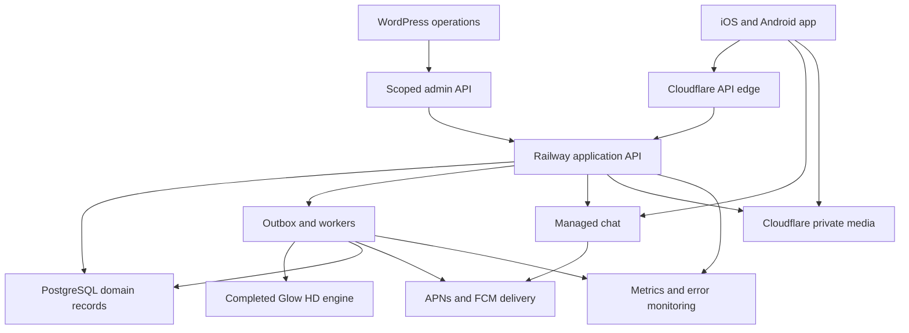
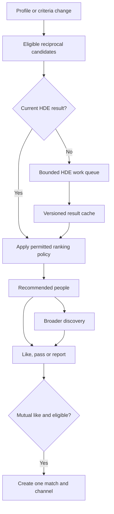

# Historical source snapshot

Captured for repository continuity on 2026-09-24. Original source: [Glow-Mobile-Dating-Implementation-Research-2026-09-23.md](https://drive.google.com/file/d/1wyYFc6nbBh0xCl6HBCgWGVH3sE8KNunq/view).

This is historical evidence, not an active assignment or governing prompt library. Current owner direction, repository PF canon and current handoff supersede obsolete Drive, role, next-action and phase-state instructions below. No Drive access is needed to use this snapshot. Recheck dated versions, pricing and provider claims before acting on them.

---

# Glow mobile dating application: implementation research and recommendation

**Research date:** 23 September 2026
**Decision:** use a current Expo/React Native foundation, a modular Python application backend with PostgreSQL, and selected managed capabilities. Build Glow's discovery, mutual matching, safety workflows, and WordPress operations interface. Do not purchase a dating clone or adopt a whole dating repository as the default path. Keep Duolicious as the one serious conditional fork alternative.

**Confidence:** high in the infrastructure and product-fit comparison; medium in relative delivery effort; conditional on the completed engine's production integration contract, team skills, launch countries, commercial-service terms, and a short integration proof. This is research and architectural due diligence, not a penetration test, executed build certification, legal opinion, or guarantee of store acceptance.

**Evidence notation:** **V** = verified in inspected source code, repository metadata, or official documentation; **D** = documented by the project/vendor but not independently demonstrated; **R** = architectural recommendation or inference; **U** = unresolved. A repository containing tests does not establish that they pass or measure production coverage. Paid source packages were not purchased or available for inspection.

The report follows the ten requested sections. Source links sit beside the relevant findings. Section 10 includes the evidence inventory, decision-changing uncertainties, and implementation entry criteria.

## 1. Requirements synthesis

### 1.1 Product and technical contract

Glow is an adults-only mobile dating product whose first discovery experience is a ranked set of compatible people. A recommendation is a suggested person, not a mutual match or permission to message. The user can act on recommendations, then continue into broader discovery; the two experiences use the same eligibility, privacy, block, and like state. Swiping is an interaction, not the matching engine.

The completed Human Design engine owns Human Design calculation and interpretation. The application owns accounts, consent, visibility, reciprocal dating preferences, candidate eligibility, presentation order, likes, mutual matches, communication, and operations. It may cache engine results with their provenance; it must not recreate the engine's compatibility mathematics.

| Capability | Minimum credible production behavior | Owner and launch acceptance |
|---|---|---|
| Identity | Verified email, secure login/recovery, session revocation, duplicate-account handling, safe account linking | Application/auth library; lost-device and password-change tests |
| Onboarding | Adult eligibility, terms/privacy acknowledgement, dating intent, reciprocal preferences, profile completeness, resumable state | Backend state machine; partial onboarding cannot appear in discovery |
| Birth inputs | Birth date/time/place and uncertainty collected privately; timezone ambiguity resolved explicitly | HDE integration; no guessed birth time or UTC fallback |
| Profiles | Photos, bio/prompts, name, age presentation, interests, pronouns/gender/preferences as appropriate, edit/pause visibility | PostgreSQL authoritative; field-level public projection |
| Photos | Upload limits, retry/order/delete, type validation, EXIF removal, quarantine/review, approved variants | Cloudflare media plus backend lifecycle; unapproved originals inaccessible |
| Verification | Email verification; account approval or risk-based selfie/identity checks where justified | Distinguish email, photo, identity, and age verification; do not imply one proves another |
| Recommended people | Best eligible candidates first, understandable Glow explanation, stable queue, explicit pending/empty/error states | Backend candidate selection plus HDE output consumption |
| Discovery | Broader eligible pool, swipe and accessible button equivalents, filters, seen/pass state, bounded resurfacing policy | Same safety/visibility rules as recommendations |
| Likes and mutual matches | Idempotent likes, one canonical pair, atomic mutual-match creation, unmatch | Database constraints and transactions; concurrent-like test |
| Messaging | One-to-one text after mutual match; delivery/retry state, unread counts, pagination, reconnect | Managed chat with backend authorization; text-only is acceptable at launch |
| Notifications | Matches/messages, explicit preferences, device-token lifecycle, quiet controls, privacy-safe lock-screen copy | APNs/FCM via selected providers; deduplicate send paths |
| Safety | Block/report from profiles and chat; scam/harassment policies; no contact after block/unmatch | Enforced server-side across every read/send surface |
| Moderation | Queue, evidence, severity, account/photo actions, reasons, appeals, audit history, escalation | Backend case records; WordPress operator interface |
| Privacy | Hidden birth details/location, profile pause, data export, visibility controls, retention policy | Backend; tests against ID enumeration and filter inference |
| Deletion | In-app deletion and public request route, immediate visibility/session revocation, asynchronous downstream purge | Durable deletion workflow; restore must not resurrect deleted accounts |
| Support | Reachable contact, case handling, account recovery and billing assistance | WordPress/backend workflow; staffed ownership |
| Billing if paid | Store purchases, restore, cancel/manage route, refund/revocation/grace state, consistent entitlements | Store/RevenueCat evidence reconciled into backend |
| Operations | Errors, service metrics, queue lag, alerts, backups, restore exercise, dependency updates | Railway and selected observability service |
| Mobile quality | Accessibility, large text, keyboard behavior, poor connectivity, upload interruption, crash handling | Real iOS/Android device QA and store-track builds |
| Abuse prevention | Signup/login/message/upload limits, enumeration resistance, spam controls, basic device/risk signals | API/Redis/edge controls; no universal trust in client flags |
| Release management | Separate environments, secret handling, repeatable builds, migrations, rollback, feature flags | CI and owned developer accounts |

Additional baseline needs omitted from the original list include unmatching, blocking after unmatching, pause/incognito semantics, password recovery, safe provider-account linking, evidence retention, appeals, push deduplication, stale recommendation invalidation, sparse-market empty states, timezone correction, accessibility alternatives to gestures, purchase restoration, and off-device deletion requests. These affect the data model and should not become late UI additions.

### 1.2 Existing Glow evidence changes the integration plan

**V:** the observed `glow-hdengine-v2` main head was [`a63bf801665fbc19839fc013fcdb05386a1b0d09`](https://github.com/amthorn78/glow-hdengine-v2/commit/a63bf801665fbc19839fc013fcdb05386a1b0d09). Its requirements include Flask, Gunicorn, psycopg, and jsonschema. The inspected HTTP adapter is [`adapter/http_reader.py`](https://github.com/amthorn78/glow-hdengine-v2/blob/a63bf801665fbc19839fc013fcdb05386a1b0d09/adapter/http_reader.py). It is not evidence of an existing FastAPI dating backend.

**V:** supplied PF05 v2.5.2 identifies `POST /api/reader?v=1` as the production application Reader route, accepting only two canonical UUIDs. Its public Reader contract is field-closed and numeric-free; eligible results expose a harmony band. The handler inspection supports that boundary. Development sampler routes are not production recommendation APIs. An internal/admin bundle is described separately in the supplied contract; a specification alone does not establish that it is implemented, deployed, or suitable for high-volume ranking.

**R:** before application implementation, pin the *completed* engine's released contract for chart resolution, internal compatibility/ranking consumption, allowed persistence, version identity, rate limits, and failures. If the final engine provides only public bands, the app cannot honestly claim to sort by a fine-grained numeric compatibility score. Either rank at the permitted band granularity with documented secondary criteria or obtain an explicitly authorized internal integration surface. Do not scrape CLI diagnostics, open dev endpoints, add numerics to Reader v1, or independently recreate Human Design scores.

This report does not declare the engine complete today, change PF contracts, or adjudicate existing engine work. The implementation schedule begins when the completed engine and its supported integration contract are available.

### 1.3 Hard constraints, preferences, and unresolved inputs

Hard constraints are two mobile platforms; PostgreSQL as primary domain database; Railway backend hosting; Cloudflare media where appropriate; WordPress as the operational interface; HDE as the intelligence authority; recommendations before broader discovery; and production safety/store readiness.

No consumer web application is needed. Small public privacy, terms, support, child-safety, and account-deletion pages are still necessary. Authentication redirects and app-link association files also do not constitute a consumer web product.

Unknowns are team experience, launch geography/language, monetization at first release, permitted source-disclosure obligations, budget for managed chat, expected launch density, required identity checks, existing production users/data in older Glow applications, and the final HDE throughput. The recommendation assumes a small capable team, one initial market, no requirement to open-source Glow's new application code, and willingness to pay for a service that materially saves engineering. These are planning assumptions, not discovered facts.

## 2. Market/repository landscape

### 2.1 Search and inspection method

Research covered public GitHub repositories and their files, licenses, manifests, trees, sampled commits/issues/PRs/releases; public GitLab discovery; vendor documentation and commercial source listings; official framework, platform, infrastructure, and store documentation; supplied Glow contract files; and connected Glow repositories/project context. Search included dating-specific products, broader social/discovery applications, mobile scaffolds, and backend starters. It did not use star count as a quality gate.

The deepest repository inspections were Duolicious, Alovoa, Afrodite, Ignite, Obytes, and Very Good CLI. Compass received targeted architecture/license inspection. Commercial candidates received documentation and licensing screening, not paid-source audits. Other marketplace products were screened out before expensive evaluation when they lacked a credible fit or inspectable evidence. Public search access to Codeberg was blocked; no conclusion about all Codeberg projects is justified. No claim of having found every dating project is made.

| Project/product | Actual category | Observed fit and disposition |
|---|---|---|
| [Duolicious](https://github.com/duolicious/duolicious) | Full open-source dating system; Expo/RN, Python, PostgreSQL, R2 | Best infrastructure-fit fork; shortlist, conditional on AGPL and product rewrite |
| [Alovoa](https://github.com/Alovoa/alovoa) + [Expo client](https://github.com/Alovoa/alovoa-expo) | Dating backend and mobile client; Java/Spring, MariaDB | Real application; database and operational migration outweigh reuse for Glow |
| [Afrodite frontend](https://github.com/afroditeapp/afrodite-frontend) / [backend](https://github.com/afroditeapp/afrodite-backend) | Flutter/Rust dating system in preview | Permissive licensing attractive; project explicitly not production-ready |
| [Compass](https://github.com/CompassConnections/Compass) | Values-based dating directory; React/Next, Capacitor, Supabase/Firebase | Real code, but web-centered architecture and AGPL modifications; not selected |
| [CompanioNation Core](https://github.com/CompanioNation/Core) | Blazor/PWA dating/social code | SQL Server assumptions, custom license, private production pieces; not selected |
| [Ignite](https://github.com/infinitered/ignite) | Maintained React Native application boilerplate | Best conventional RN boilerplate alternative; no dating backend |
| [Obytes starter](https://github.com/obytes/react-native-template-obytes) | Expo/RN production-oriented starter | Useful conventions; observed SDK lag and open setup issues |
| [Expo default template](https://github.com/expo/expo/tree/main/templates/expo-template-default) | Official mobile scaffold and framework | Recommended base at a pinned stable release, not repository main |
| [Very Good CLI](https://github.com/VeryGoodOpenSource/very_good_cli) | Flutter project generator | Strong alternate if implementation team is materially stronger in Flutter |
| [Cookiecutter Django](https://github.com/cookiecutter/cookiecutter-django) | Backend project generator | Reuse selectively for deployment/settings/tests; not a dating platform |
| [Instamobile / Dopebase dating kit](https://dopebase.com/docs/react-native/apps/dating-app/getting-started) | Commercial RN/Flutter dating source | Firebase architecture is integral; shortlist only as purchase comparator |
| [Dating Pro](https://help.datingpro.com/en/articles/8870199-dating-pro-for-developers-and-agencies-source-code-white-label-hiring-help-affiliate-program) | Commercial PHP dating system with mobile options | Broad vendor-described functionality; MySQL/CodeIgniter and web-first assumptions |
| [Loveria bundle](https://codecanyon.net/item/loveria-dating-bundle-pack-laravel-php-dating-script-and-flutter-mobile-apps-for-android-and-ios/45527262) | Laravel + Flutter commercial bundle | Source unavailable for audit; migration and license uncertainty |
| [QuickDate](https://codecanyon.net/item/quickdate-the-ultimate-php-dating-platform/23268605) | PHP dating product with separately sold mobile products | Separate mobile/backend lifecycle and unverified source; reject as current baseline |
| [SkaDate](https://www.skadate.com/) | Commercial dating platform/services | Landscape screen only; insufficient verified source evidence to prefer over shortlist |
| [NativeExpress](https://www.native.express/) | Commercial mobile SaaS starter | Potential auth/billing/UI acceleration, but no verified dating/safety implementation advantage |
| pH7Builder / PHP dating CMS projects | Web dating CMS family surfaced through GitLab/public search | Wrong consumer architecture; not shortlisted or audited |

Tutorial Tinder clones, swipe-card libraries, UI-only Flutter kits, no-code hosted dating builders, and WordPress dating themes are not equivalent to production dating platforms. They may supply licensed presentation components; they do not establish secure authorization, abuse handling, deletion, native billing, or maintainability.

### 2.2 Where reusable code really saves time

High-value reuse is authentication machinery, mobile navigation and native integration, image upload/delivery, chat transport and conversation UI, billing lifecycle, background job execution, database migrations, crash reporting, and build/release tooling. These have well-established libraries or services.

Glow-specific development remains eligibility, HDE integration, recommendation freshness, the recommendation-to-discovery experience, mutual matching, safety across service boundaries, and the WordPress case workflow. Buying those features in a mismatched Firebase/MySQL product often means replacing the same backend twice: first its assumptions, then its discovery semantics.

### 2.3 Existing owned code should be assessed before third-party purchase

The connected [`amthorn78/glow-backend-v4`](https://github.com/amthorn78/glow-backend-v4) is an important owned asset. Observed main was [`1b91efd4777f3b990c7272cdf000dd0b4c44b7b4`](https://github.com/amthorn78/glow-backend-v4/commit/1b91efd4777f3b990c7272cdf000dd0b4c44b7b4), last commit 22 September 2025. Its README describes auth, profiles, preferences, compatibility, birth data, and admin endpoints. Files include session, CSRF, rate-limit, audit, and test modules. That is useful project history, not proof of a releasable mobile dating service.

Concrete observations from [`app.py`](https://github.com/amthorn78/glow-backend-v4/blob/1b91efd4777f3b990c7272cdf000dd0b4c44b7b4/app.py), first 250 lines:

- SQL echo and an event handler logging query parameters are enabled in code. Production use could expose personal data; actual deployed logging configuration was not inspected.
- Configuration permits a known development secret fallback, filesystem sessions, and rate-limit fallback to memory. Their production reachability must be checked rather than assumed.
- A credentialed CORS allowlist includes a broad Vercel subdomain pattern. This warrants tightening and CSRF/session review; it is not a demonstrated exploit.
- Legacy compatibility/scoring modules and an external HD vendor URL are present. They must not become a second source of Human Design intelligence.
- The dependency manifest contains older pinned framework/library versions. No vulnerability scan was executed, so specific CVEs are not asserted.

**Decision:** time-box a salvage assessment of schema, migrations, validated auth work, and existing tests. Do not deploy this snapshot unchanged. If its production usage and tests prove a smaller safe path, retain a refactored Flask application API instead of migrating just for framework preference. The default Django recommendation applies when that assessment does not establish a material reuse advantage. Never change or discard an existing production database based on this report alone.

## 3. Candidate shortlist

### 3.1 Bounded decision shortlist

| Rank/path | Role | Recommendation | Confidence |
|---|---|---|---|
| 1. Stable Expo + modular Python/PG backend + managed chat | Assemble proven components | Default implementation path | High fit; delivery estimate remains conditional |
| 2. Duolicious fork | Reuse a full dating platform | Retain only if license acceptance and adaptation proof succeed | High source visibility; medium product-fit confidence |
| 3. Ignite-based RN app | More opinionated mobile starter | Use if team values its conventions and upgrade proof is cheaper | Medium-high |
| 4. Very Good Flutter app + same backend | Cross-platform alternative | Prefer if team has stronger demonstrated Flutter delivery ability | High technical feasibility; team fit unknown |
| 5. Dopebase/Instamobile dating source | Best purchase comparator | Do not purchase for the fixed infrastructure without source-level proof | Low source confidence; verified architecture mismatch |

Alovoa is the most relevant near-shortlist exclusion and is examined below. Obytes is a legitimate starter alternative, but not a distinct whole-system strategy. No commercial source product cleared the evidence threshold for a positive purchase recommendation.

### 3.2 Duolicious: strongest fork, significant product surgery

**Origin/license.** Public [repository](https://github.com/duolicious/duolicious), [AGPL-3.0 license](https://github.com/duolicious/duolicious/blob/main/LICENSE). Commercial use and modifications are allowed under its obligations; AGPL is not a noncommercial license. Modified network deployments and distributed clients raise source/notice/compliance obligations. An HTTP boundary does not automatically establish that a proprietary engine is legally independent. Assess the actual combination, client distribution, dependencies, artwork, and store terms before adoption. Existing store distribution does not settle Glow's licensing obligations.

**Actual architecture.** The inspected [`frontend/package.json`](https://github.com/duolicious/duolicious/blob/main/frontend/package.json) uses Expo 55, React Native 0.83.6, React 19.2, native purchase and notification integrations. [`backend/service/api/asgi.py`](https://github.com/duolicious/duolicious/blob/main/backend/service/api/asgi.py) is FastAPI/ASGI, including chat WebSocket integration. Older developer documentation still mentions Flask-related deployment details; current code must take precedence. Backend services use PostgreSQL, Redis, S3-compatible Cloudflare R2, SMTP and background jobs. RevenueCat is present for mobile purchases; web payment code is a separate concern. Sources: [backend developer guide](https://github.com/duolicious/duolicious/blob/main/backend/DEVELOPER.md), [requirements](https://github.com/duolicious/duolicious/blob/main/backend/requirements.txt).

**Dating functionality and mismatch.** The documented product is personality-question and conversation-first: it does not require a like/swipe mutual-match gate before introductory messages. Its search implementation includes candidate querying, cached search state, preference handling, and personality-oriented ranking. Glow would replace substantial ranking semantics and add a mutual-like state machine and authorization gate. Merely putting a Glow card at the top leaves two incompatible recommendation systems. Source: [search module](https://github.com/duolicious/duolicious/blob/main/backend/service/api/search/__init__.py).

**Safety/auth evidence.** Auth/session modules exist, with server-side session invalidation; a concrete integration test checks deletion invalidates cached sessions on two devices. Report, moderation, verification, and account deletion code/tests are present. Their existence is stronger than a README checklist but is not an end-to-end safety audit. Sources: [session implementation](https://github.com/duolicious/duolicious/blob/main/backend/service/api/auth/session.py), [deletion/session test](https://github.com/duolicious/duolicious/blob/main/backend/test/functionality1/delete-account-session-cache.sh), [moderation test](https://github.com/duolicious/duolicious/blob/main/backend/test/functionality1/moderation.sh).

**Maintenance.** Observed main `48751345aa4edd7c7c42dbe318f7d284b99fc19d`, committed 23 September 2026. Last ten sampled commits were by one account, `duogenesis`; this demonstrates concentrated recent activity, not that no other contributors exist. The five sampled recent PRs showed merges. No entries were returned from the queried GitHub Releases collection; versioning also occurs in source commits. Backend CI defines nine functionality suites plus other checks, and frontend workflows cover types/lint/Jest/Playwright. Tests were not run. [Commit history](https://github.com/duolicious/duolicious/commits/main/), [PRs](https://github.com/duolicious/duolicious/pulls), [backend CI](https://github.com/duolicious/duolicious/blob/main/.github/workflows/backend-test.yml).

**Concrete concern.** [Issue 1649](https://github.com/duolicious/duolicious/issues/1649), open when inspected, reports that a country filter can reveal information despite hidden location. This is a reporter's claim, not a reproduced vulnerability. It identifies a threat Glow should test: preferences, filtering and repeated queries may disclose information absent from profile JSON. The backend requirements also include unpinned dependencies and a mixed dependency list, warranting a reproducible lock and native-package audit.

**Infrastructure/admin/scaling.** PostgreSQL and R2 are unusually good fits. Railway still requires service decomposition, configurable connection URLs, supported extensions, worker/cron separation, pooling, healthchecks, storage and restore configuration. Replace hardcoded Docker-network assumptions. A WordPress plugin can call an added admin API, but is not supplied. Existing search and chat are reusable only after authorization, privacy and load checks. No measured scale capacity was established.

**Store implications.** Native integrations are a useful starting point; project claims of store availability are not a Glow review approval. Rebrand deeply, upgrade toolchains, audit permissions/privacy manifests/purchases, remove unwanted intro-message behavior, validate deletion, and resolve AGPL distribution requirements.

**Adaptation effort, R:** high despite broad feature coverage. Work includes deleting personality-question coupling, integrating HDE, adding mutual-match authorization throughout chat, new recommendations UI, identity mapping, WordPress admin API, infrastructure extraction, dependency/toolchain upgrades, privacy and billing QA, branding and licensing. It can beat a fresh domain implementation only if a short spike proves those seams are localized. Otherwise maintaining a heavily diverged fork becomes continuing cost.

### 3.3 Official Expo foundation: recommended mobile base

**Origin/license.** [Expo](https://github.com/expo/expo) is an open-source framework and native tooling ecosystem; the repository license is MIT and the inspected default template declares 0BSD. Dependency licenses remain separate. The default template's repository main was already using an SDK 58 preview; **do not build from unpinned main**. Official release documentation showed SDK 57 as stable and SDK 58 in beta at research time. Use the supported stable SDK and its documented React Native version as a unit. [Create-project documentation](https://docs.expo.dev/get-started/create-a-project/), [changelog](https://expo.dev/changelog), [template manifest](https://github.com/expo/expo/blob/main/templates/expo-template-default/package.json), [license](https://github.com/expo/expo/blob/main/LICENSE).

**Architecture/reuse.** TypeScript, React Native, Expo Router, native modules and development builds. Add a small accessible Glow design system, a server-state query library, form validation, secure credential storage and the chosen chat/billing SDKs. Expo's web capability need not be shipped. EAS is optional build/distribution infrastructure, not the application database or backend.

**What it does not supply.** No dating profiles, matching, moderation, authoritative auth service, image policy, subscriptions business rules, WordPress administration, or production test coverage for Glow. Calling this a ready-made dating application would be false.

**Fit.** Any HTTP backend on Railway; PostgreSQL/Cloudflare integration occurs through application APIs. HDE remains private to backend workers. There is no inherited recommendation logic to remove. Native chat and IAP SDK integration, notifications, accessibility and release tooling remain explicit engineering work.

**Maintenance/security/scaling.** Prefer official stable release cadence over an older template snapshot. Pin dependencies, scan actual release artifacts, validate config plugins and native SDK compatibility. Use real development/release builds, not Expo Go as the acceptance environment. Mobile rendering performance requires profiling large image lists; framework choice does not determine backend scale.

**Adaptation effort, R:** low scaffold adaptation, substantial domain implementation. This is the most predictable effort because work directly implements Glow's requirements instead of reconciling conflicting product models.

### 3.4 Ignite and Obytes: credible starters, not complete systems

| Dimension | Ignite | Obytes |
|---|---|---|
| License | MIT; license explicitly explains ownership of generated application code, subject to dependency licenses | MIT, actual license inspected |
| Observed head | `e829d2f922c5568a59a77bfb6232aeb500be3f13`, 30 Apr 2026 | `fd9b358ed11913d2a49fd9ffa6582fe03ba130e7`, 2 Jun 2026 |
| Release sample | v11.5.0, 18 Mar 2026 | v9.0.0, 27 Jan 2026 |
| Actual mobile manifest | Expo 55, RN 0.83.2; React Navigation, API helpers, storage, localization | Expo 54, RN 0.81.5; Expo Router, TanStack Query/Form, Zustand, Uniwind, storage |
| Tests/tooling visible | Jest, Maestro and build configuration | Jest, Maestro, CI and EAS conventions |
| Activity nuance | Multiple accounts in sampled history; open SDK-upgrade PR and reported demo-removal issue | Open environment/build/scheme issues and SDK-upgrade requests |
| Auth/chat/media/backend | API integration patterns; no finished Glow implementation | API integration patterns; no finished Glow implementation |
| Infrastructure fit | Backend-agnostic; good | Backend-agnostic; good |
| Key cost | Upgrade and decide whether team benefits from supplied conventions | Larger observed SDK gap; verify reported setup defects before reuse |

Sources: Ignite [manifest](https://github.com/infinitered/ignite/blob/master/boilerplate/package.json), [license](https://github.com/infinitered/ignite/blob/master/LICENSE), [releases](https://github.com/infinitered/ignite/releases), [issues](https://github.com/infinitered/ignite/issues); Obytes [manifest](https://github.com/obytes/react-native-template-obytes/blob/master/package.json), [license](https://github.com/obytes/react-native-template-obytes/blob/master/LICENSE), [releases](https://github.com/obytes/react-native-template-obytes/releases), [issues](https://github.com/obytes/react-native-template-obytes/issues).

A snapshot lag is not proof of abandonment or insecurity. It is a measurable upgrade task. Neither starter makes WordPress admin, HDE ranking, billing policy or safety disappear. Ignite is the stronger ready-opinionated choice if a team accepts its architecture; otherwise stable Expo plus selectively reused conventions has less template migration overhead. Do not merge several starters into one project.

### 3.5 Very Good CLI / Flutter: credible alternative

The [Very Good CLI repository](https://github.com/VeryGoodOpenSource/very_good_cli) provides project generation, flavors, testing/lint conventions and related tooling under MIT. Observed head was `56825adafe75c6bc4d08a3e292996be40d49b3ca`, 21 September 2026; release 1.5.0 was published 8 September, following releases in August and June. Sampled history included bot maintenance and substantive human work; recent PRs showed active maintenance. [Releases](https://github.com/VeryGoodOpenSource/very_good_cli/releases), [license](https://github.com/VeryGoodOpenSource/very_good_cli/blob/main/LICENSE).

Use the current `very_good create flutter_app` path, not an assumed obsolete generator name. A generated application provides no dating backend, auth service, chat server, media infrastructure or moderation system. The same Railway/PostgreSQL/Cloudflare/backend/WordPress design applies. Flutter has capable native builds and commercial SDKs; run the same chat, IAP, notification, accessibility and deletion proof.

**R:** comparable total domain effort to the Expo path. Prefer Flutter if the actual delivery team is materially stronger in Dart/Flutter or if design requirements benefit enough from its rendering model. No evidence establishes that Flutter or React Native automatically passes store review more easily. HDE is server-side, so its Python implementation does not favor either client framework.

### 3.6 Dopebase / Instamobile: purchase comparator, not recommended purchase

The current [dating getting-started guide](https://dopebase.com/docs/react-native/apps/dating-app/getting-started) describes package-dependent assets and Firebase configuration. Older Instamobile documentation redirects into Dopebase. The [recommendation algorithm documentation](https://instamobile.io/docs/apps/dating-app/recommendation-algorithm/) describes recommendation generation around profile/preference changes and client consumption of stored recommendations.

**D:** the package can supply RN/Flutter dating screens, Firebase authentication, Firestore profile/swipe/match/chat state, Storage images, and Functions/backend hooks depending on purchase. **U:** paid source quality, current exact native SDK versions, comprehensive tests, transaction correctness, moderation depth, deletion propagation, live production limits, security review, and precise modification/redistribution/support rights for the chosen package.

Replacing Firebase Auth, Firestore queries/listeners, security rules, Storage and Functions is a backend replatform, not a connection-string change. Retaining those core systems would depart from the requested primary backend/database arrangement. A hybrid where PostgreSQL mirrors Firebase can introduce two authorities, reconciliation and deletion gaps. The card UI is reusable only if licensing permits and extracting it saves more effort than composing ordinary RN components.

**R:** high and uncertain adaptation effort under Glow's constraints; potentially faster only if infrastructure constraints changed and source audit cleared. The recommendation-first design requires changing both server generation and client feed selection. WordPress needs a custom backend admin surface regardless. Vendor publication claims cannot establish review success for a rebranded Glow product.

Before any purchase, require a clean build of the exact deliverable; dependency/lockfiles; architecture walkthrough; transactional mutual-like and block tests; deletion and data export demo; current native billing/SDK compliance; maintenance history; an issue/security process; commercial-use and paid-subscription rights; ownership of bundle IDs/signing accounts; source for every server component; and written scope of updates/support. Missing evidence is grounds to defer purchase, not proof the vendor's code is bad.

### 3.7 Alovoa: examined near-shortlist exclusion

Actual [backend](https://github.com/Alovoa/alovoa) is Java 17/Spring Boot with MariaDB documented as its production database; the inspected `pom.xml` uses Spring Boot 3.4.4 and MariaDB/H2 dependencies. The [mobile client](https://github.com/Alovoa/alovoa-expo) manifest uses Expo 54/RN 0.81.5. Code is AGPL-3.0; README notes that images are proprietary unless specified otherwise. Rebranding therefore includes an asset-rights review.

The system has user/auth, search, likes, conversations, block/report and account-deletion structures. In [`MessageService.java`](https://github.com/Alovoa/alovoa/blob/master/src/main/java/com/nonononoki/alovoa/service/MessageService.java), sending checks conversation membership and both sides' blocks, stores messages through the conversation repository and can send email notifications. This confirms server-side behavior, not a proven high-volume mobile realtime system. [`SearchService.java`](https://github.com/Alovoa/alovoa/blob/master/src/main/java/com/nonononoki/alovoa/service/SearchService.java) contains location/age/preference logic and existing sort modes, including donation-related ordering. Those policies must be replaced, not merely restyled. It also contains branches accommodating under-legal-age users; Glow must enforce its own adult-only admission regardless of configurable defaults.

Observed backend head `408e45fbcd34a284ba55f3fe04753cd048b2b46b` was 29 April 2026; the latest sampled release was v2.0.0 on 19 January 2025. Some PR activity continued later, including translations. This is slower maintenance, not demonstrated abandonment. Tests and JaCoCo configuration are visible; no measured coverage or passing run was established. Documentation gives a useful service overview but not a verified Glow/Railway production runbook.

Railway can host Java, but PostgreSQL migration requires checking schema, types, repository queries, pagination, indexes, migrations and tests; JPA is not proof of automatic portability. Cloudflare requires adapting the media pipeline. WordPress requires an admin API. Android distribution links exist; current iOS production availability and complete store compliance were not independently verified. AGPL, database conversion, toolchain updates, realtime validation and replacing search semantics make this a weaker shortcut than Duolicious.

## 4. Elimination record

“Eliminated” means unsuitable as Glow's default foundation under these constraints, not a judgment that the project has no value.

| Candidate | Concrete evidence | Why it loses for Glow | What would change the decision |
|---|---|---|---|
| Afrodite | Backend README explicitly says not production-ready and store release unavailable; preview frontend/backend versions must match; Flutter/Rust and encrypted messaging | Launch would inherit platform stabilization, native packaging and moderation/reporting design work; permissive licensing alone does not offset it | Stable store builds, operational evidence, safety tests and a localized Glow integration |
| Compass | Actual `LICENSE` is AGPL; `NOTICE` applies AGPL to Compass modifications while original polylove code remains MIT; `capacitor.config.ts` bundles `web/out` | Web/Capacitor architecture and Supabase/Firebase service split do not fit a new app-first backend cleanly; directory/direct-message model differs | Explicit choice to adopt its web-based client and disclosure model, plus backend migration proof |
| CompanioNation | README identifies Blazor WASM, SignalR, SQL Server, private Services/iOS repositories and public Core stubs; custom CNPL license | Public Core is not the entire shipped production stack; relational migration and wrapper/client changes are substantial | Full audited source, clear commercial rights, and a justified .NET/SQL migration plan |
| Alovoa | MariaDB/Spring, AGPL, Expo 54, slower release cadence; concrete search/message coupling | More adaptation than the best fork and no demonstrated advantage over a fresh Glow domain layer | Existing Java team plus verified migration and iOS readiness |
| Dating Pro | Vendor developer guide specifies CodeIgniter 3, PHP 7.4+ and MySQL 5.7+; source/mobile/API availability is vendor-described | Advertised minimum versions are not a secure deployment prescription; PHP/MySQL assumptions and existing web/admin surface conflict with target architecture | Paid-source inspection proves current supported runtime, PG portability, complete native source and safe extension hooks |
| Loveria | Laravel/Flutter bundle, PHP platform documentation specifies MySQL; listing last update 17 Oct 2025; paid source uninspected | Database migration, uncertain native freshness and safety depth; low sticker price is not adaptation evidence | Current reproducible builds, tests, safe schema portability and suitable paid-product license |
| QuickDate | PHP platform plus distinct Android/mobile listings | No verified unified, current source/test/release baseline for both stores under Glow's infrastructure | Complete version-matched source packages and a demonstrated migration path |
| SkaDate | Vendor source/mobile offering; only landscape screening completed | Insufficient technical evidence to justify purchase over candidates with inspectable code | Source access and successful architecture/security review |
| NativeExpress | Public commercial mobile starter/documentation; paid implementation not inspected | No proven advantage for the dating/safety/domain work over official Expo; service-coupling savings unproven | Exact source package demonstrates net savings without replacing core infrastructure |
| PHP CMS / WordPress dating themes | Consumer web/CMS product model | Would make WordPress/web assumptions central instead of a thin admin surface | A different product brief |
| Tutorial/UI clones | No verified complete backend, safety operations or maintained store release process | Reusing screens cannot meet launch responsibilities | Promotion to a maintained, audited product with full evidence |
| Older Glow backend, unchanged | SQL parameter logging, development fallbacks, legacy scoring/vendor coupling in inspected source | Does not yet establish a safe baseline for this new mobile product | Bounded salvage audit, upgrade and security remediation |

Primary evidence: Afrodite [backend README](https://github.com/afroditeapp/afrodite-backend), [frontend README](https://github.com/afroditeapp/afrodite-frontend); Compass [NOTICE](https://github.com/CompassConnections/Compass/blob/main/NOTICE), [LICENSE](https://github.com/CompassConnections/Compass/blob/main/LICENSE), [Capacitor config](https://github.com/CompassConnections/Compass/blob/main/capacitor.config.ts); [CompanioNation README](https://github.com/CompanioNation/Core); [Dating Pro developer guide](https://help.datingpro.com/en/articles/8870199-dating-pro-for-developers-and-agencies-source-code-white-label-hiring-help-affiliate-program); [Loveria backend listing](https://codecanyon.net/item/loveria-the-laravel-php-dating-platform-script/25832186); [QuickDate Android listing](https://codecanyon.net/item/quickdate-android-mobile-dating-platform-application/23380884).

Afrodite's current backend documentation includes PostgreSQL dependencies; excluding it because it is supposedly SQLite-only would be inaccurate. Likewise, Compass has mobile projects; the objection is its actual web-based mobile architecture and adaptation cost, not an assertion that it has no mobile code.

### 4.1 Licensing comparison

| License family | Commercial use / modification | Distribution consequence for decision |
|---|---|---|
| MIT / BSD / Apache / 0BSD | Generally permitted under the relevant notice/patent/attribution terms | Audit dependencies and assets separately; do not erase notices |
| AGPL-3.0 | Commercial use and modifications permitted | Source obligations for covered work, including relevant modified network use; review client/store distribution and combination boundaries |
| Commercial source license | Depends on purchased product/tier | Written rights for one or both apps, paid users, backend modification, builds, developers, updates, assets and redistribution required |
| Envato Standard license | Regular vs Extended materially differs | Official table permits a sold end product under Extended, not Regular; resolve Glow subscriptions against full license/FAQ before purchase |
| Custom CNPL / ambiguous licensing | Cannot infer from a repository badge | Review exact terms and all private dependencies before treating as reusable |

Source: [Envato license comparison](https://codecanyon.net/licenses/standard). Repository-specific license files above are the controlling evidence used here. Separating a process over HTTP is good engineering, but this report does not treat it as a legal safe harbor for copyleft obligations.

## 5. Architecture options

### 5.1 Mobile architecture comparison

| Architecture | Advantages for Glow | Costs and limits | Decision |
|---|---|---|---|
| React Native + Expo | Shared TypeScript UI/business integration, mature native SDK ecosystem, straightforward custom feed/chat UI, established build tooling | Native dependency upgrades, config-plugin compatibility, list/image profiling and platform-specific QA remain | Default; best balance in absence of contrary team evidence |
| Flutter | Shared Dart UI, consistent rendering, mature mobile tooling, viable chat/billing SDKs | Team must own Dart and plugin/native integration; existing RN components cannot simply transfer | Equally credible when team expertise favors it |
| Swift/SwiftUI + Kotlin/Compose | Direct platform control and excellent native integration | Two UI implementations, duplicated feature/release QA and more staffing | Use for strong existing native teams or proven platform-specific requirements |
| Kotlin Multiplatform | Shared domain/network logic; can retain native UIs or consider Compose Multiplatform | Gradle/Swift integration and SDK interop add decisions; two native UIs still cost two UIs | Technically viable, not the shortest default for this brief |
| Capacitor/PWA wrapper | Reuses an existing web application | Glow has no consumer web requirement; inherits web UI and bridging concerns without a pre-existing web asset worth preserving | Not selected; wrappers are not categorically prohibited by stores |

React Native's official guidance recommends a framework such as Expo for new applications. Flutter's official architecture guidance supports layered, testable applications. Kotlin's supported-platform documentation lists Android and iOS as stable; rejecting KMP as inherently experimental would be outdated. These are ecosystem facts, not measurements of Glow delivery speed. Sources: [React Native setup](https://reactnative.dev/docs/environment-setup), [Flutter architecture](https://docs.flutter.dev/app-architecture), [Kotlin platform support](https://kotlinlang.org/docs/multiplatform/supported-platforms.html).

The decisive technical experiment is identical on RN and Flutter: two real devices complete login, photo upload, one HDE-backed recommendation, mutual match, chat, block and push, followed by a signed release build. If the intended team can demonstrate this materially faster in Flutter, use Flutter without changing the backend design.

### 5.2 Recommended complete system

The diagram represents a proposed deployment, not current Glow infrastructure.

The app-to-chat path is authorized realtime reception and permitted channel operations; the proposed send path is app → Glow API → chat service. Media upload/download uses narrow signed capabilities issued after backend checks. The WordPress admin API is a separate permission surface within the application service, not a separate microservice required at launch. Moderation/support records live in PostgreSQL and are operated through WordPress. Subscription notifications enter authenticated backend webhooks; they are omitted from the diagram to preserve readability.

| Layer | Recommended choice | Reuse and responsibility |
|---|---|---|
| Mobile | Stable Expo/React Native + TypeScript + Expo Router | Official scaffold; small Glow-specific component system and screens |
| Application API | Django 5.2 LTS + Django REST Framework, modular monolith | ORM/migrations/validation/auth integration; no HDE rewrite |
| Authentication | django-allauth headless; initially verified email/password and recovery | Add Apple/Google only when product requires; secure session/token lifecycle |
| Database | Railway PostgreSQL; spatial extension only if selected and tested | Authoritative users, preferences, matches, cases, entitlements, recommendation metadata |
| Jobs | Celery workers + Redis broker/cache; PostgreSQL outbox | Retryable HDE work, recommendation refresh, deletion, notifications, reconciliation |
| HDE | Existing completed engine as private service | Sole HD computation owner; separately versioned deployment and data ownership |
| Chat | Stream Chat, subject to integration/commercial proof | Transport, realtime sync, message history, unread state and UI components |
| Photos | Cloudflare Images with private delivery; R2 for private evidence/export objects when needed | App controls authorization, quarantine, retention, cleanup and moderation |
| Push | Expo notifications for application events; Stream's APNs/FCM integration for chat | Distinct event ownership prevents duplicate message pushes |
| Billing | StoreKit/Play Billing through RevenueCat when monetization launches | Backend authoritative entitlement projection; stores remain purchase authority |
| Administration | Small custom WordPress plugin + scoped backend APIs | Operator UI only; no dating-domain replication into WordPress |
| Monitoring | Railway metrics/logs + mobile/backend error reporting, e.g. Sentry | Redaction, alert routing, release tagging; analytics events separate from private content |

**Why Django rather than automatically copying HDE's Flask stack?** The dating backend benefits from mature account integration, migrations, relational domain modeling, permissions and operational conventions. It does not need a bespoke async framework just because chat is realtime; managed chat handles persistent connections. Django's own admin can remain disabled or restricted to emergency engineering use; it does not replace the requested WordPress surface. Django 5.2 LTS was officially supported through April 2028 in the inspected support table. Use the latest supported patch and test the complete dependency set. [Django support](https://www.djangoproject.com/download/).

The current [Cookiecutter Django README](https://github.com/cookiecutter/cookiecutter-django) targets Django 6.0/Python 3.14, offers PostgreSQL and optional REST/Celery/Sentry/Docker configuration, and includes a generated-project coverage claim. That claim is not coverage for Glow. Reuse its settings, CI and deployment patterns selectively; do not generate its current defaults and pretend they are a validated 5.2 LTS project. A small official Django project with deliberately selected dependencies is acceptable. Its [BSD license](https://github.com/cookiecutter/cookiecutter-django/blob/main/LICENSE) permits reuse subject to its terms.

FastAPI + SQLAlchemy/Alembic plus managed identity is a sound alternative, especially for a team already fluent in it. NestJS is also viable for a TypeScript-heavy backend team. Neither has a demonstrated advantage here sufficient to outweigh a mature relational/auth stack. The bounded existing-Flask salvage assessment in §2.3 takes precedence if it proves substantial safe reuse. Framework switching is not itself a product improvement.

### 5.3 Authentication and data boundaries

allauth's current headless API explicitly supports mobile sessions and session-token or JWT strategies; its JWT integration includes DRF support, rotating refresh tokens, and optional stateful validation. **R:** enable stateful validation/revocation for Glow; a banned/deleted account must not retain access until an arbitrary JWT expiry. Store mobile credentials in platform secure storage; never embed signing, HDE, media or chat secrets. Staff tokens need a separate audience and permission set. Sources: [headless introduction](https://docs.allauth.org/en/latest/headless/token-strategies/introduction.html), [JWT strategy](https://docs.allauth.org/en/latest/headless/token-strategies/jwt-tokens.html), [MIT license](https://github.com/pennersr/django-allauth/blob/main/LICENSE).

Separate stable application UUIDs from provider IDs and HDE person/chart identifiers. Account linking requires verified ownership; never merge merely because an untrusted provider response contains a matching email. Birth information is private input, not public profile metadata. Keep the HDE service/database ownership boundary: no app or WordPress direct writes to engine tables, no cross-database foreign-key dependency, and no copying raw vendor payloads contrary to the engine's persistence contract.

Recommended relational modules include accounts/sessions, profiles/photos, preferences/consent, likes/matches/blocks, recommendations, moderation/support, entitlements, and audit/outbox/deletion. These are modules in one application, not ten separately deployed services.

### 5.4 Recommendation-first design and HDE integration

**Eligibility first.** Exclude self, minors, suspended/deleted/unapproved/paused accounts, either-direction blocks, incompatible reciprocal preferences, and already exhausted candidates. Apply distance/location policy without exposing precise coordinates. User safety constraints are never overridden by a high compatibility value or a paid feature.

**Engine result consumption second.** Resolve engine person/chart IDs through approved paths. Request only bounded candidate work through the completed HDE contract. Store the minimum permitted output with engine release, input/chart revisions, calculation status, timestamps and expiry. Distinguish an HD pair result from viewer-specific ranking; a symmetric pair calculation does not make preferences or relevance symmetric. Only canonicalize pair cache keys if the engine contract explicitly guarantees symmetry.

**Product ranking third.** Within eligible results, apply the approved Glow ordering, freshness and diversity policy. The app may combine non-HD product criteria such as distance or activity only as an explicit product decision. It must not invent a numeric HD score or convert bands into a pseudo-precise percentage. Public HDE output stays within its contract. A separate app DTO may contain profile age, pagination and display position without widening Reader v1.

**Queue fourth.** Persist a small ranked queue per viewer with a queue version and source revisions. Use cursor pagination and stable ordering; do not reshuffle every screen refresh. Recheck eligibility on read and again on actions. A block, deletion or suspension takes effect immediately even if background recomputation is delayed. Store impressions separately from likes and passes. Define whether “pass” means temporary skip or persistent rejection before launch.

**Experience.** The home screen opens recommended people, explains the recommendation in approved language, and offers a visible “Explore more” action. Users need not labor through every recommendation before browsing. Both feeds share match state and suppress unwanted duplicates. Existing conversations and safety/support remain reachable while recommendations are computing. Empty or stale results have truthful states; never fabricate compatibility or secretly fall back to another HD calculator.

**Recalculation triggers.** Chart/birth correction, relevant preference change, new eligible profile, engine/ranking version change, account-state change and periodic freshness. Chart changes invalidate affected compatibility keys. Discovery preference changes usually invalidate viewer queues without recomputing unchanged HD pair results. Ban/block/delete invalidates access synchronously and schedules downstream cleanup. Deduplicate jobs and debounce noncritical bursts.

**Avoid the all-pairs trap.** At 100,000 users, unordered all-pairs storage means 4,999,950,000 pairs. This arithmetic is not a capacity benchmark; it shows why global precomputation is the wrong default. Use indexed eligibility, bounded candidate retrieval, lazy/queued pair calculation, top-K queues and cache eviction. If preselection restricts the pool, describe recommendations as strongest within that eligible evaluated pool—not mathematically proven best across everyone. Benchmark HDE latency before setting batch size or freshness promises.

### 5.5 Mutual matching, chat and safety consistency

Store directed likes with unique `(actor, target)` constraints and mutual matches with a unique canonical pair. In one database transaction, validate both users and create the match plus an outbox event. The worker provisions the chat channel idempotently. A provider timeout must not create a second match/channel; show a recoverable provisioning state.

**Managed chat is justified** because it avoids building reconnect, unread state, message history pagination, offline behavior, realtime fan-out and mobile UI from scratch. It is a conscious exception: **Stream stores message content outside PostgreSQL.** PostgreSQL remains authoritative for account/match/block/case state, but is not falsely described as the sole storage system for all data. Export/deletion APIs, contractual retention, region choice, evidence access and exit costs must be accepted.

The official [React Native SDK](https://getstream.io/chat/docs/sdk/react-native/) and [moderation documentation](https://getstream.io/chat/docs/react-native/moderation/) provide relevant building blocks. [Export](https://getstream.io/chat/docs/node/exporting-channels/) and [deletion](https://getstream.io/chat/docs/unreal/gdpr/) operations are documented; these require application orchestration and plan verification, not merely SDK installation.

**Critical verified behavior:** Stream's [before-message-send webhook](https://getstream.io/chat/docs/node/before-message-send-webhook/) fails open when unreachable or too slow. It must not be the sole block/match authorization control.

**Recommended MVP control:** configure channel permissions so clients cannot create channels, add arbitrary members, or send directly. Route sends through Glow's authenticated API, validate current match/account/block state, and use the server SDK to send. Use the vendor SDK for realtime reads/UI with a customized send handler. Test every mutation path, including edit/reply/attachment APIs; disable unused paths initially. Serialize conflicting send/block/unmatch actions per pair, use idempotent message IDs, and define how already accepted in-flight messages are handled. Vendor-side channel restrictions and token revocation provide a second layer. [Permissions documentation](https://getstream.io/chat/docs/python/chat-permission-policies/), [channel creation](https://getstream.io/chat/docs/react-native/creating_channels/).

This is a proposed integration that must be proved on the selected SDK/version and plan. The backend's send endpoint should fail closed on uncertain authorization. Do not replace the fail-open webhook with an equally unsafe client-only check. If the custom send integration becomes disproportionately expensive, reassess vendor-native enforcement or another provider using the same safety acceptance tests.

Text-only chat at launch avoids unsolicited media exposure and a second image-moderation pipeline. Reports should retain the minimum necessary message IDs/context under a documented evidence policy; do not bulk-copy all private messages into analytics or WordPress. End-to-end encryption is not a launch promise: adding it changes reporting, recovery and moderation design and deserves a separate project.

### 5.6 Media, push, background jobs and failure behavior

Cloudflare's [direct creator uploads](https://developers.cloudflare.com/images/storage/upload-images/direct-creator-upload/) issue limited upload URLs without giving the client an API token. **R:** require approved private delivery, enforce upload ownership/size/count, verify decoded image type, remove metadata, moderate before discoverability, and clean abandoned uploads. A signed URL is a bearer capability: use bounded expiry and avoid caching it across users. Blocking cannot retract an image already downloaded or screenshotted; the product should not imply otherwise.

Use R2 when object-level evidence/export storage or a custom media pipeline is required. Its [S3 presigned URL documentation](https://developers.cloudflare.com/r2/api/s3/presigned-urls/) describes access primitives, not content moderation. Do not maintain duplicate image stores without a reason. At low launch volume, staffed photo approval plus user reports is a credible starting control; specialist automation becomes useful as volume rises. Identity verification images need stricter access and retention than profile photos.

Expo's [push service](https://docs.expo.dev/push-notifications/overview/) abstracts APNs/FCM transport. Using FCM for Android notification delivery does not require Firebase as Glow's database/auth platform. Keep device installation records, remove invalid tokens, process receipts/retries, and make notifications hints rather than the source of truth. The app fetches current authorized state after opening a notification. Chat push and app-event push must not both send the same message event.

| Failure | Product behavior | Technical response |
|---|---|---|
| HDE unavailable | Valid existing recommendations may remain within freshness rules; new results show pending | Backoff/circuit breaker, bounded jobs; no alternate HD computation |
| Chat provider unavailable | Existing match visible; send shows pending/failed truthfully | Idempotent retries and reconciliation; no duplicate sends |
| WordPress unavailable | Consumer app continues; operators use incident procedure | Domain API/jobs independent of WordPress |
| Redis unavailable | Critical authorization remains database-backed; recommendations may be delayed | Persist intent in PG outbox; recover workers without losing events |
| Image processing unavailable | Upload remains pending and private | Retry/review queue; never publish unapproved originals |
| Billing webhook delayed | Last verified state plus explicitly defined grace policy | Server reconciliation; no client-declared premium access |
| Deletion task partially fails | Account remains inaccessible and absent from discovery | Durable per-system completion tracking and retries |

### 5.7 Alternative whole-system architectures

**Duolicious fork:** Expo client → modified Duolicious API/chat → PostgreSQL/Redis; R2 for media; replace personality ranking with a private HDE adapter and Glow queues; add mutual-match domain rules before chat; expose scoped admin endpoints for WordPress. Keep its existing realtime stack if audit and load tests support it. This avoids managed chat fees but transfers operational responsibility to Glow and creates upstream-merge costs. HDE remains a separate authority.

**Commercial source adaptation:** purchased RN/Flutter client → replacement or substantially rewritten application API → PostgreSQL; migrate auth, rules/listeners, files and background functions; add HDE queues and WordPress API. Preserving the vendor's Firebase/MySQL backend would be faster, but fails the stated architecture goal unless expressly accepted. Keeping both as equal authorities is the least attractive option.

**Flutter assembly:** replace the Expo client with a Very Good Flutter application; retain the complete recommended backend/service arrangement. This is a client choice, not a reason to redesign the database or HDE.

**Substantially custom libraries path:** plain RN/native/Flutter shells, custom auth orchestration and custom PostgreSQL/WebSocket chat. Maximum control and lower vendor dependence, but much more code for communication, recovery, unread state, mobile lifecycle and moderation. Use only when managed chat economics, data-residency or contractual requirements justify that investment. Do not build it solely to avoid a modest recurring bill before validating product demand.

### 5.8 Build-versus-adapt decision model

| Approach | Real acceleration | Hidden work | Long-term ownership | Relative verdict |
|---|---|---|---|---|
| Mature open-source dating fork | Existing profiles/chat/safety/UI | License, product-model replacement, upgrades, deployment extraction, fork divergence | Broad source control; inherited architecture | Worth one bounded Duolicious proof |
| Commercial dating source | Screens and conventional flows | Unseen quality, database/auth replacement, vendor update limits, license terms | Contract-dependent | No currently justified purchase |
| Mature mobile framework + reusable backend/services | Native tooling, auth, data modeling, chat, billing | Glow domain and integration still required | High ownership of differentiating logic | Best expected balance |
| Mostly custom application around libraries | Exact fit, little inherited product coupling | Most communication, security and release plumbing | Maximum responsibility | Slower default; selectively custom only |

The correct cost equation is acquisition + upgrades + removals + new features + infrastructure migration + security/store remediation + continuing maintenance. The number of screens included in a template is a poor proxy for that total.

The user's willingness to build from scratch does not justify reinventing standard capabilities. The recommended approach is a new Glow application assembled from mature components. “Scratch” should describe ownership of the product/domain layer, not writing a new authentication system, chat transport, image CDN, purchase validator or mobile framework. Existing dating software is widespread; a maintained, safely licensed, modular implementation that also fits PostgreSQL, Railway, Cloudflare, WordPress and Glow's discovery contract is much rarer in the inspected set.

## 6. App-store compliance analysis

### 6.1 Requirements that change architecture

Policy snapshot: 23 September 2026. Recheck the final binary, store countries and applicable programs immediately before submission. An upstream app's acceptance does not transfer to a Glow fork.

| Area | Verified policy / requirement | Glow implementation implication |
|---|---|---|
| Apple dating-category risk | 4.3 treats dating as saturated and expects differentiation | Demonstrate Glow's recommendations and native quality |
| Apple template/minimum-functionality risk | 4.2/4.2.6 address thin apps, templates and content-provider submission | Glow owns submission; deliver meaningful customization |
| Apple UGC | 1.2 requires filtering, reporting, timely response, blocking and contact details | Ship controls and staffed operations |
| Apple login | 4.8 requires an equivalent privacy-preserving option alongside qualifying social login; first-party-only systems have an exception | Pair iOS Google login with Sign in with Apple; Google login itself is optional |
| Apple push | 4.5.4 restricts required, sensitive and marketing push usage | Optional push; consent for marketing; private payloads |

Source for the five Apple rows: [App Review Guidelines](https://developer.apple.com/app-store/review/guidelines/). The implications are proposed Glow product responses, not predictions of approval. Swiping is not categorically prohibited; avoid objectifying public ratings, anonymous/random-chat positioning, or unsafe sexual-content behavior.

| Area | Official evidence | Required implementation / verification |
|---|---|---|
| Apple deletion | [Account-deletion requirement](https://developer.apple.com/news/?id=12m75xbj), [token revocation](https://developer.apple.com/documentation/signinwithapplerestapi/revoke-tokens) | Findable in-app deletion, not merely deactivation; revoke Apple authorization when applicable |
| Google deletion | [Deletion requirements](https://support.google.com/googleplay/android-developer/answer/13327111?hl=en) | In-app deletion path and external web request resource that works without reinstalling; cover associated data and disclose legitimate retention |
| Google adult access | [Age-restricted functionality](https://support.google.com/googleplay/android-developer/answer/16302250?hl=en) | Core dating apps must use Play Console tools to block minors; the incidental-dating exception does not fit Glow |
| Google child safety | [Social/dating child-safety standards](https://support.google.com/googleplay/android-developer/answer/14747720?hl=en) | Public anti-CSAE standards, in-app feedback/reporting, action on CSAM, legally appropriate reporting and a child-safety contact; adult-only positioning does not remove this duty |
| Privacy declarations | [Apple privacy management](https://developer.apple.com/help/app-store-connect/manage-app-information/manage-app-privacy), [Google Data safety](https://support.google.com/googleplay/android-developer/answer/10787469?hl=en) | Inventory actual SDK/backend collection, use, sharing and retention; keep labels/forms aligned with production |
| SDK privacy | [Apple manifests](https://developer.apple.com/documentation/bundleresources/privacy-manifest-files), [required-reason APIs](https://developer.apple.com/documentation/bundleresources/describing-use-of-required-reason-api), [Google SDK responsibility](https://support.google.com/googleplay/android-developer/answer/13323374?hl=en-GB) | Audit the final linked dependencies and aggregate manifest; unused tracking SDKs can still matter |
| Photo access | [Google restricted permissions](https://support.google.com/googleplay/android-developer/answer/16935362?hl=en) | Use system photo selection for profile uploads; do not request broad photo-library permissions merely for occasional selection |
| Unexpected sensitive collection | [Google disclosure/consent](https://support.google.com/googleplay/android-developer/answer/11150561?hl=en) | Contextual explanation and consent where required; do not hide unexpected collection in terms |
| Review access | [Google app review preparation](https://support.google.com/googleplay/android-developer/answer/9859455?hl=en) | Stable review access, instructions and available backend; demonstrate matches/chat/safety without location or approval dead ends |
| New personal Play accounts | [Testing requirement](https://support.google.com/googleplay/android-developer/answer/14151465?hl=en) | If applicable, 12 continuously opted-in testers for 14 days before applying for production access; account type/date must be checked |

**Location recommendation:** start with manually selected city/region or foreground coarse location, with an alternative when permission is denied. Do not collect background location for ordinary dating discovery. Never return exact coordinates or exact distance values that enable triangulation; repeated filter changes and tiny population groups also need privacy testing. Birthplace and current location are distinct fields with distinct purposes.

**Age recommendation:** enforce an 18+ product boundary server-side, complete accurate Apple/Google age questionnaires, configure the relevant store controls, and define suspected-minor handling. A birth-date field or checkbox is not strong age verification. The needed assurance level depends on launch market and risk; avoid unnecessary identity-document collection before that decision.

**Safety operations:** require clear community rules, harassment/scam/impersonation reporting, explicit consent to UGC terms, trained case handling, appeal routes and urgent escalation coverage. A purchased “report” button without staff or backend actions does not meet the operating need. Do not ask moderators to download suspected illegal material into unmanaged devices or general WordPress uploads.

### 6.2 Payments and subscriptions

For a paid MVP, use native store purchases via RevenueCat, one straightforward subscription tier, a restore flow, price/renewal disclosures, manage/cancel routing and server-verified entitlements. Handle renewals, billing retry/grace, refunds, chargebacks, revocation, cross-device login and out-of-order webhooks. Account deletion and subscription cancellation are different operations; the deletion flow must clearly explain and link subscription management without blocking lawful deletion.

It would be inaccurate to say external digital payments are prohibited everywhere. Rules differ by storefront and program. Google's current [US external links program](https://support.google.com/googleplay/android-developer/answer/16470497?hl=en) and [US alternative billing program](https://support.google.com/googleplay/android-developer/answer/16497028?hl=en) permit defined alternatives with enrollment/integration conditions; its [external offers program](https://support.google.com/googleplay/android-developer/answer/14372887?hl=en) has a different arrangement. Apple provides [external purchase mechanisms](https://developer.apple.com/documentation/storekit/external-purchase) with region/program-specific rules. Do not apply an exception globally or assume it eliminates fees or reporting.

**R:** for fastest launch across both stores, use the standard native purchase route and postpone regional external-checkout optimization. A WordPress/Stripe checkout is not the default mechanism for unlocking in-app dating features. If the first release is free, omit paywalls and billing SDKs until needed while keeping an entitlement boundary in the backend. A free launch still needs all safety/privacy/deletion work.

### 6.3 Current build requirements

| Requirement observed | Meaning for implementation |
|---|---|
| Apple: Xcode 26+ and iOS 26 SDK+ since 28 Apr 2026 | Build-tool/SDK floor, not a requirement that every user device run iOS 26; choose supported deployment targets separately |
| Google: new mobile apps and updates target Android 16 / API 36 from 31 Aug 2026 | Check release manifest, not just framework version; do not plan a new product around a temporary extension |
| Android 16 KB page-size compatibility | Validate every bundled native library and release artifact, including chat, image, crypto and billing dependencies |
| Play Billing v7 deadline 31 Aug 2026, extension to 1 Nov 2026 | Select a supported billing implementation, normally v8+ at this snapshot; inspect the native transitive dependency |

Sources: [Apple upcoming requirements](https://developer.apple.com/news/upcoming-requirements/), [Google target API policy](https://support.google.com/googleplay/android-developer/answer/11926878?hl=en), [Android page sizes](https://developer.android.com/guide/practices/page-sizes), [Billing version timeline](https://developer.android.com/google/play/billing/deprecation-faq.html).

Release acceptance includes TestFlight and Play test-track installation, actual push credentials, deep links, denied permissions, app restart/offline transitions, deletion, report/block, restore purchase if present, and reviewer access. Use production-equivalent synthetic review fixtures with explicit authorization; do not ship a universal test OTP or undocumented authentication bypass.

### 6.4 Privacy and launch-country review

Dating preferences may reveal sexual orientation or sex-life information. The UK's ICO identifies these as special-category data; processing requires an appropriate lawful basis and additional condition, and high-risk processing may require a DPIA. Applicability and the corresponding rules elsewhere depend on launch countries. This research did not conduct a complete jurisdiction-by-jurisdiction legal review. Sources: [ICO special-category definition](https://ico.org.uk/for-organisations/uk-gdpr-guidance-and-resources/lawful-basis/special-category-data/what-is-special-category-data/), [rules/DPIA](https://ico.org.uk/for-organisations/uk-gdpr-guidance-and-resources/lawful-basis/special-category-data/what-are-the-rules-on-special-category-data/).

Architectural response: minimize these fields; separate public profile presentation from private preferences; record applicable consent versions; restrict staff access; avoid advertising SDKs and session replay on private screens at launch; redact birth inputs, tokens and message bodies from logs. Choose processor agreements, data regions, retention and transfer arrangements before production. Human Design results should be presented as the product's interpretive compatibility system, without unsupported promises of scientific, medical or guaranteed relationship outcomes.

## 7. WordPress administration design

### 7.1 Investigated alternatives and decision

| Option | What it actually solves | Fit for Glow |
|---|---|---|
| [WPGetAPI](https://wordpress.org/plugins/wpgetapi/) | Connecting WordPress to APIs, with additional paid automation/auth features | Useful for limited read-only prototypes; does not supply domain RBAC, moderation state machines, evidence handling or audit semantics |
| [WP Webhooks](https://en-gb.wordpress.org/plugins/wp-webhooks/) | Event/action integrations and workflow automation | Potential notifications/integrations; unsuitable as authoritative moderation/deletion execution |
| Embedded vendor admin dashboard | Reuses vendor tools | Splits identity/audit/workflows and may fail embedding restrictions; not the clean default |
| Direct PostgreSQL access from WordPress | Quick CRUD access | Reject: bypasses application invariants, permissions and audit; couples PHP/plugin code to schema |
| Dating records as WordPress users/posts | Familiar CMS operations | Reject: creates a second domain authority and migration/deletion burden |
| Small custom admin plugin using backend APIs | Exact operator screens and controlled actions | Recommended after evaluating generic plugins; narrow custom work is justified |

Use WordPress for navigation, authenticated staff UI and rendering. Keep matching, moderation decisions, entitlement state, case history and deletion execution in the backend. WordPress will ordinarily still need its own MySQL/MariaDB database for its settings and staff/CMS state; PostgreSQL remains the primary *dating application* database. Do not force WordPress onto PostgreSQL using an unsupported compatibility layer just to make every storage component identical.

### 7.2 Trust and authorization model

1. Staff authenticate with MFA. Prefer an existing organizational identity provider if one is already available; otherwise establish a backend-issued staff authentication flow. Do not infer that WordPress administrator status equals unrestricted dating-data access.
2. The plugin obtains a short-lived backend credential bound to the actual staff identity and admin audience. Keep credentials server-side; use revocable sessions and narrow scopes. A shared broad service key plus an editable `actor_id` header is insufficient attribution.
3. The backend maps verified staff identity to its own roles and checks every object/action. WordPress capabilities hide unavailable UI and add defense, but do not grant backend authority.
4. WordPress request nonces protect against CSRF, capability checks protect UI actions, and API authorization protects domain changes. These are distinct controls.
5. Record actor, action, target, reason, prior/new state, request ID and timestamp in an append-oriented backend audit record. Sensitive evidence views should also be logged.

WordPress documentation explicitly warns that nonces are not authentication or access control. Its REST cookie/application-password mechanisms concern WordPress endpoints; they do not automatically authenticate requests to Glow's custom backend. Sources: [nonces](https://developer.wordpress.org/apis/security/nonces/), [REST authentication](https://developer.wordpress.org/rest-api/using-the-rest-api/authentication/), [HTTP API](https://developer.wordpress.org/plugins/http-api/).

For a small first release, backend-issued staff sessions are sufficient; a new enterprise SSO platform is not required solely for this plugin. Exact login/token plumbing is one of the initial implementation proofs. A WordPress compromise remains a serious risk because it is an authorized operational surface: keep its plugin set minimal, patch promptly, isolate it from general marketing plugins, restrict access at the edge where appropriate, and scope credentials so the blast radius is bounded.

### 7.3 Proposed screens and API contract

These are proposed app endpoints, not existing HDE routes.

| Operator surface | Backend capability | Access boundary |
|---|---|---|
| User search/detail | Paginated masked profile/status search | Support role sees minimum needed data; no broad birth-data export |
| Account approval | Approve/reject with reason and version precondition | Moderator capability; audit action |
| Suspend/ban/restore | Domain transition plus token/channel/visibility effects | Senior moderator or administrator; reason and appeal context |
| Photo review | Short-lived private preview; approve/reject/remove | No WordPress Media Library copy |
| Report/case queue | Assign, prioritize, review evidence, resolve/reopen | Case-scoped evidence; urgent escalation workflow |
| Support | User-linked tickets and recovery/billing references | Separate private staff notes from user-visible replies |
| Subscription status | Verified current entitlement and purchase-provider reference | Read-only by default; manual grants distinct and audited |
| Glow matching inspection | Engine version, input revisions, status, allowed explanation | No unrestricted raw engine/admin output for all staff |
| Configuration | Validated flags/limits with history | Allowlisted settings; never arbitrary SQL, secrets or engine math |
| Operations | Queue lag, failures, deletion progress, service status | Safe summaries; no raw logs containing personal data |

Actions should be commands such as “suspend account” rather than arbitrary field edits. Use optimistic version checks for conflicting case decisions, idempotency keys for retryable commands, cursor pagination, fixed API origins, request timeouts, output escaping and input validation. The backend owns all side effects. Never use WP-Cron as the sole scheduler for deletion, match recomputation or safety actions.

### 7.4 Administrative failure and data handling

If the plugin times out after submitting a command, query the command result using its idempotency key rather than repeating an ambiguous mutation. If WordPress is down, app APIs, workers, matching and deletion continue. Establish a narrow audited emergency operator procedure; do not add an unauthenticated “maintenance” endpoint.

Keep reports, staff notes, consent and evidence retention in backend-owned records. WordPress caches should contain only short-lived redacted read models. Backups of WordPress should not accidentally become permanent copies of dating photos/messages. A data export request is a backend job delivered through a short-lived user-authorized download, not a CSV assembled in the browser by querying every table.

## 8. Fastest credible MVP path

### 8.1 Scope that preserves production quality

Launch into one defined market/language with an intentionally small, real user cohort. Include verified account access, adult eligibility, private birth onboarding, moderated profile photos, reciprocal preferences, recommended people first, accessible swipe/browse second, likes/mutual matches, text chat, notifications, block/report/unmatch, account pause/deletion, support and working WordPress moderation. Include basic measurement, crash reporting, backups and an incident owner.

Defer video/audio calls, user-to-user media messages, stories, groups, social feeds, live location, elaborate boosts/coins, multiple subscription tiers, generative relationship coaching, full automated identity checks for everyone, and multi-region databases. These are scope reductions, not excuses to omit safety or reliability. A verification badge should communicate exactly what has been verified.

A free first release is the shortest credible path if monetization need not begin on day one. If revenue at launch is required, add one store subscription and its complete lifecycle. Keep block, report, deletion and basic safety outside paywalls.

### 8.2 First decision stage: bounded reuse proof

Spend approximately five working days, with actual implementers, resolving the assumptions that could change the choice. This is a proposed implementation stage; no spike was executed during this research.

| Proof | Concrete output | Decision rule |
|---|---|---|
| HDE handoff | Released schemas, example results, identity/version rules, error behavior, allowed persistence and measured latency | No numeric ranking assumption without an approved engine capability |
| Existing Glow salvage | Current deployed-use inventory; build/test result; schema/auth security findings; reusable-module list | Preserve safe proven assets where cheaper than replacement |
| Expo/native services | Signed iOS/Android builds; login, upload, push, chat send/block; billing sandbox if paid | Resolve native SDK/toolchain problems before building many screens |
| Duolicious feasibility | License position plus a minimal recommendation-first queue and mutual-match chat gate | Fork only if changes stay localized and retained features demonstrably reduce effort |
| Staff operations | One authorized WordPress action with backend audit and revocation | Establish trustworthy admin boundary before expanding UI |

Do not run a month-long beauty contest among templates. Duolicious is the only whole-app fork that merits this final proof from the inspected candidates. If source-disclosure/distribution obligations are unacceptable, stop that branch immediately and use the assembly path. If the proof shows most of its ranking/chat authorization must be replaced, stop treating its feature count as a time saving.

### 8.3 Delivery sequence and exit criteria

| Stage | Deliverable | Exit evidence |
|---|---|---|
| 0. Scope and contracts | Launch market, adult policy, initial business model, HDE contract, data map and reuse decision | Named owners and resolved integration assumptions |
| 1. Production skeleton | Mobile builds, API/PG, auth/recovery, CI/environments, basic monitoring | Real devices authenticate; secrets and migrations controlled |
| 2. Profile and candidate supply | Onboarding, preferences, private photos, approval, visibility | Unapproved/paused/blocked profiles absent from all feeds |
| 3. Glow discovery | HDE adapter/cache, recommendation queue, browse, likes/mutual matches | Version/freshness tests; no duplicate matches; engine failures handled |
| 4. Communication and operations | Text chat/push, block/report/unmatch, WordPress cases/actions, deletion | Multi-device and provider-failure tests; operator can resolve actual cases |
| 5. Paid lifecycle, if needed | Purchase/restore/reconciliation and entitlement UI | Sandbox renew/refund/grace/out-of-order-event scenarios pass |
| 6. Release hardening | Accessibility, privacy declarations, device/load/security review, recovery drill | Store-track build and launch checklist based on observed behavior |
| 7. Controlled release | Staffed initial cohort and monitored rollout | Crash/latency/safety/support criteria met before widening acquisition |

Some work overlaps, but domain dependencies remain: authorization precedes messaging, account visibility precedes ranking, and deletion must cover every service actually introduced. Start developer-account enrollment, privacy copy and reviewer-access preparation early; do not leave administrative lead time until the code is finished.

### 8.4 Effort estimates: planning ranges, not measured quotations

These ranges are architectural estimates with substantial uncertainty. Assumptions: completed HDE with usable production contracts; roughly three experienced engineers covering mobile/backend/integration, fractional design/QA/security and WordPress support, one market, text-only chat, no legacy-user migration, and prompt product decisions. They include production domain work and release preparation; they exclude completing HDE, staff hiring, legal negotiations and unpredictable store-review delays. They are not additive across options.

| Option | Indicative elapsed engineering range | What principally determines the range |
|---|---|---|
| Stable Expo + reusable Python backend/services | 12–20 weeks | Auth/native service integration, recommendation contract, WordPress/safety completeness |
| Very Good Flutter + same backend, strong Flutter team | 12–20 weeks | Comparable scope; skill and SDK integration determine variance |
| Ignite-based implementation | 12–21 weeks | Can save conventions/setup; current-template upgrade can consume those savings |
| Duolicious fork | 12–24 weeks, only after licensing clears | Extent of personality-ranking removal, match-gated chat changes, upgrade/rebrand/testing |
| Dopebase commercial source moved to target infrastructure | 16–28 weeks | Firebase extraction plus ordinary Glow work; paid-source quality unknown |
| Alovoa adaptation | 16–28 weeks | MariaDB migration, search changes, native updates, realtime/store validation |
| Mostly custom clients and self-hosted chat | 18–30+ weeks | Messaging reliability, sync, moderation and mobile lifecycle ownership |
| Two native UI applications with the same backend | 18–30+ weeks for this small team | Duplicate UI work and platform QA; a larger native team changes the comparison |

Treat the lower ends as feasible only with a disciplined scope and an experienced available team. If the five-day proof exposes missing HDE interfaces, uncertain data migration or major SDK incompatibility, re-estimate immediately. The overlapping ranges are intentional: source inspection cannot prove a fork will be slower in every team. The recommendation rests on predictable fit and lower inherited uncertainty, not fabricated precision.

### 8.5 Recurring-service economics

Verified Stream list pricing at research time showed Build at 1,000 MAU/100 concurrent connections; Start at **US$499/month**, or **US$399/month billed annually**, with 10,000 MAU/500 concurrent connections. Limits, overages, moderation features, export, retention, regions and support should be checked against the actual contract. Do not assume the free tier supplies the intended production guarantees. Source: [Stream pricing](https://getstream.io/chat/pricing/).

RevenueCat's published pricing showed free usage up to US$2,500 monthly tracked revenue, then 1% of tracked revenue. This is not the app stores' commission and should not be modeled as the only payment cost. Source: [RevenueCat pricing](https://www.revenuecat.com/pricing).

Railway, Cloudflare, email, observability and optional identity/moderation services add usage-based costs; no complete Glow workload exists to price them accurately. Model compute/DB/backup storage, image count and delivery, email sends, chat MAU/concurrency, analytics ingestion, store fees and human moderation separately. Cap telemetry and media retention deliberately. The initial chat bill is a visible recurring cost; a custom chat system has less visible engineering/on-call costs. If approximately US$500/month for chat is unacceptable, make that a decision input before selecting the managed-chat path—not a surprise after development.

### 8.6 Release tests that protect real users

Meaningful acceptance tests include:

- Two simultaneous reciprocal likes create exactly one match and channel; retries preserve identity.
- A malicious client cannot chat without a valid match, create its own channel, bypass a block, read another user's private profile, or claim an entitlement.
- Block/unmatch races, chat-service outage and authorization-hook failure do not reopen access; already accepted in-flight behavior is documented.
- Deletion revokes all devices, removes discovery/media access and completes provider cleanup despite a worker restart; restore does not resurrect access.
- Preference and chart revisions invalidate the right caches without calculating every pair again; HDE timeout never fabricates a result.
- A moderator can review, act, explain and audit; concurrent staff actions cannot silently overwrite one another.
- Purchase events are authenticated/idempotent and out-of-order events reconcile correctly, if billing is included.
- Permission denial, slow connections, app termination, large text and screen readers preserve key flows.
- A backup is actually restored, with measured recovery time, and the resulting environment cannot send production messages/pushes accidentally.

These are launch acceptance criteria, not tests claimed to have passed in this research. Add a focused independent security assessment of authorization, sensitive-data handling and administrative access before unrestricted public launch.

## 9. Expansion path

### 9.1 Scale in response to observed bottlenecks

| Area | Initial production | Architecturally support now | Add when measurements justify it |
|---|---|---|---|
| PostgreSQL | One well-sized primary, migrations, indexes, bounded connections, backups/PITR | Stable IDs, schema ownership, cursor pagination, data retention | HA topology, replicas for suitable reads, partitioning of large event/history tables |
| Candidate queries | Indexed eligibility and bounded pool; explain representative queries | Pluggable candidate retrieval separate from HDE evaluation | PostGIS where validated, denormalized eligible sets or specialized search |
| Recommendations | Small versioned queues and result cache; async refresh | Engine/policy/input versions, retry/idempotency, invalidation events | Batch pipelines, segmented worker pools, more sophisticated retrieval/reranking |
| Realtime chat | Managed vendor with enforced channel permissions and export plan | Provider ID mapping and integration boundary | Capacity plan, negotiated pricing or carefully planned provider migration |
| Media | Private Cloudflare delivery, upload limits, moderation, cleanup | Stable object IDs, lifecycle metadata, reprocessing hooks | Automated classification, specialized video pipeline only if introduced |
| Jobs | Dedicated workers plus single scheduler and durable outbox | Retry/dead-letter/reconciliation semantics | Separate queues by urgency, autoscaling within DB/provider limits |
| Notifications | APNs/FCM delivery with receipts and preferences | Installation identity, event IDs, opt-outs | Dedicated notification orchestration and campaign controls |
| Rate limiting | Per-account/IP/action limits and aggregate abuse signals | Shared counters and server-side policy | Risk scoring, device attestation or specialist anti-abuse services |
| Moderation | Staffed queue, clear escalation and appeals | Structured cases/evidence, audit, policy versions | Specialist tooling, automation triage, additional shifts and quality review |
| Observability | Crash/error monitoring, latency/error/queue metrics, synthetic checks | Release tags and redaction | Distributed tracing, warehouse analysis and sophisticated SLO budgets |
| Infrastructure | One region close to initial users; independent app/worker services | Stateless API, external sessions/media, reproducible deployment | More API replicas, regional read strategy, explicit multi-region failover design |

### 9.2 Railway and database realities

Railway can run the API and workers as distinct services. Its documented replica model does not provide sticky sessions; store sessions/shared state externally and budget connections across all replicas and workers. Persistent volumes impose different constraints from stateless services, so adding API replicas is not the same as making the PostgreSQL service highly available. Sources: [scaling](https://docs.railway.com/deployments/scaling), [volume reference](https://docs.railway.com/volumes/reference), [multi-region failover guide](https://docs.railway.com/guides/multi-region-api-failover).

Current Railway documentation **does provide PostgreSQL PITR** using pgBackRest/WAL archiving to a Railway bucket, with explicit enablement and retention behavior. Do not assume it is enabled on an existing service. Restore creates a new service; WAL archival health must be monitored, because archive failure can truncate the recovery window. Source: [PITR documentation](https://docs.railway.com/volumes/point-in-time-recovery).

**R:** set initial recovery objectives—for example an RPO of 15 minutes and RTO of four hours—as goals to prove, not guarantees supplied by this report. Enable appropriate backups/PITR, monitor archive age, exercise restoration and record ownership. Decide whether a separately controlled backup/export is required for account-level failure. Keep deletion tombstones/retention procedures so restoring an older database cannot reactivate deleted users or republish removed photos.

Use application connection limits and a pooler when justified. Keep unbounded ORM relationship loading out of discovery and chat-adjacent endpoints. Safety checks, account status and matching transactions must read authoritative state; a lagging replica must never allow a blocked or deleted user back into a feed. Use query plans and realistic seeded data before buying more infrastructure.

### 9.3 Recommendation and workload economics

Measure eligible-candidate counts, HDE latency distribution, cache hit rate, queue freshness, retry volume, cost per recommendation batch and effective recommendation coverage. A preference edit should not recompute every HD result. Bulk engine upgrades should run as controlled migrations with version coexistence and rollback, not an uncontrolled all-user stampede.

Suggested initial engineering targets, to validate rather than advertise: cached feed API p95 below roughly 500 ms in the launch region, prompt safety-state enforcement at the API boundary, and visible queue progress for slow HDE work. Latency budgets need actual engine/provider measurements. Capacity planning should model peak active users, sends per second, photo uploads and worker demand; registered-user count alone is insufficient.

Do not add vector search merely because another dating project uses pgvector. Glow's initial compatibility ranking is a structured engine result. Embedding retrieval, learning-to-rank, experimentation and relationship features can be added later with explicit data/consent boundaries and a measured benefit. Keep paid promotion separate from compatibility claims if it is ever introduced.

### 9.4 Migration strategy and exit options

Use additive schema changes, backfills with progress markers, compatible API versions and feature flags. Old mobile releases persist in the wild; backend contracts need a deprecation policy. Keep engine-result and ranking-policy versions distinct so a UI release is not required for every backend calculation update.

For managed-chat exit, retain stable Glow user/match IDs, vendor channel mapping, documented export capability, retention decisions and an import plan. Periodically test a bounded export. A vendor adapter reduces coupling but does not make history, read receipts, attachments and push behavior portable for free. Do not dual-write every message to PostgreSQL from day one unless a clear retention/search requirement justifies reconciliation cost.

For old Glow data, first establish whether real accounts exist, whether consent permits migration, what chart IDs mean and whether passwords are portable. Use a reviewed migration plan or user reauthentication; do not blindly import legacy compatibility scores as current engine truth. For a fork, pin the upstream base and track security fixes deliberately; avoid pulling moving main into production.

### 9.5 Product growth is also an operations problem

A technically scalable app can still fail when a small local pool produces weak recommendations or support queues go unanswered. Launch-market density, genuine profiles, trustworthy explanations, fast abuse response and conversation quality should be measured alongside crashes and latency. Track recommendation impression → meaningful like → mutual match → first response, with privacy-preserving event design. Avoid recording full birth details, message bodies or private matching features in analytics.

Later Glow-specific relationship features should reuse the engine contract and existing consent model. Examples include deeper pair explanations, saved reflections or opt-in relationship tools. They should not introduce a second HD calculation path or expand public engine output without the appropriate governed contract change.

## 10. Final implementation recommendation

### 10.1 The decision

**Build a new Glow product layer on mature reusable components. Do not build the standard infrastructure from scratch, and do not buy or fork a whole dating application by default.**

Use **stable Expo/React Native and TypeScript**, a **Django/DRF modular application API**, **Railway PostgreSQL**, **Redis/Celery workers**, **Cloudflare private media**, and **Stream Chat** after its safety integration and terms pass the initial proof. Use **django-allauth headless** for identity and **RevenueCat** when monetization is introduced. Retain the completed HDE as a separately owned private service. Build a small **WordPress administrative plugin** over scoped backend APIs.

This is a concrete default, with two evidence-based overrides: keep/refactor the existing Flask backend if the salvage review proves it is substantially safer and faster than replacement; select Flutter if the actual implementation team has a clear Flutter delivery advantage. Neither override changes PostgreSQL authority, HDE ownership, safety semantics or the recommendation-first product.

| Reuse | Build for Glow | Do not adopt by default |
|---|---|---|
| Official mobile scaffold/native modules and build tooling | Onboarding/profile UI and private birth-input experience | Tutorial clones and generic swipe UI as a whole product |
| Auth/recovery/session libraries | HDE integration and result/version handling | Legacy duplicate HD scoring |
| PostgreSQL ORM/migrations and job libraries | Candidate eligibility, ranking policy and queues | Firebase/MySQL migration without a demonstrated net saving |
| Managed chat transport/history/UI | Mutual-match/send authorization and safety propagation | Unrestricted intro messaging or client-only block checks |
| Cloudflare upload/delivery primitives | Photo moderation/lifecycle and access policy | Public permanent URLs for private/restricted media |
| Store billing lifecycle service | Entitlements and product pricing rules | WordPress checkout as a global store-policy shortcut |
| WordPress staff UI shell | Moderation/support commands, RBAC and audit | WordPress as dating database or direct PG editor |
| Existing Glow code where proven safe | Migration and integration tests at actual boundaries | Wholesale reuse of an unaudited old backend |

**Fork:** only Duolicious remains a defensible whole-app option, and only after license acceptance and a successful localized adaptation proof. **Purchase:** no dating source product reviewed has enough verified fit to justify buying it as the implementation foundation. A service purchase for chat/billing is different: it buys a bounded operational capability rather than an inherited dating architecture.

### 10.2 Why this balances time and quality

The recommended path spends new engineering on the parts that define Glow and on safety boundaries that must exist in any option. It reuses the hard generic systems. It avoids paying for a complete template and then replacing its database, auth model, recommendation algorithm and admin layer while retaining mostly screens.

A fork could still win in a hands-on proof; the report does not claim otherwise. Duolicious's PostgreSQL/R2 fit and substantial code/tests make it worth that test. Its AGPL obligations, conversation-first model and ranking coupling prevent an unconditional recommendation. Commercial source visibility is too limited to claim a more certain shortcut.

### 10.3 Major risks and decision-changing evidence

| Risk/unknown | Consequence | Resolution before broad implementation |
|---|---|---|
| Final HDE integration lacks permitted ranking data/throughput | Product promise cannot be implemented honestly | Pin released internal/public contracts and benchmark bounded batches |
| Existing Glow backend has significant safe reusable work or real users | New framework could add unnecessary migration cost | Salvage and production-data inventory first |
| Team is substantially stronger in Flutter/native/Flask | Default stack may be slower for that team | Real-device vertical proof with actual implementers |
| AGPL terms are acceptable and Duolicious extension seams are clean | Fork may reduce total delivery time | License review plus one bounded fork experiment |
| Managed chat permissions/custom send cannot meet safety behavior | Blocking/unmatching can leak communication | Fail-closed integration proof with hostile-client and outage tests |
| Chat budget/data-region/retention terms unacceptable | Service choice unsuitable despite technical convenience | Confirm costs and contract; re-estimate self-hosted or alternate provider path |
| Moderation/support staffing missing | Technically complete app is not operationally releasable | Name owners, response process and escalation coverage |
| Broad launch geography or identity assurance requirements | More legal/privacy/verification work | Select initial countries and perform targeted review |
| Engine or native SDK/toolchain changes during development | Rework and store submission delay | Pin versions, maintain upgrade cadence, test release artifacts early |
| Poor launch density | Good ranking has too few eligible people | Controlled geographic/cohort launch and honest empty states |

### 10.4 First concrete implementation steps

1. Pin the completed HDE release and integration contract, including what ranking values may be consumed internally and displayed publicly.
2. Inventory the older Glow backend's deployed use and run the bounded salvage review; preserve useful schemas/tests without inheriting unsafe defaults or legacy scoring.
3. Confirm the initial market, free-versus-paid launch, team skills and managed-chat budget; these materially change effort.
4. Create the mobile/API skeleton at supported pinned versions and prove two-device login, private photo upload, HDE recommendation, mutual match, controlled chat, block and push.
5. If licensing is acceptable, give Duolicious a strictly bounded competing adaptation proof and compare remaining work—not screen counts.
6. Implement the first WordPress moderator command with actual backend identity/authorization/audit, then extend the same pattern.
7. Freeze the launch scope, create an evidence-based implementation backlog from §1/§8, and begin the staged build. Keep engine-governance changes separate from this research decision.

### 10.5 Evidence inventory and reproducibility

Repository metadata and source were inspected on the research date. Pinned heads below identify the sampled default-branch history. Some individual file reads used the then-current default branch; no immutable full-repository snapshot or complete source audit was made. Re-pin and diff before implementation, especially for repositories active during the research day.

| Source | Pinned/sample identity | Inspection performed |
|---|---|---|
| Glow HDE v2 | `a63bf801665fbc19839fc013fcdb05386a1b0d09` | Requirements, architecture/context, HTTP Reader handler; supplied PF05 integration boundaries |
| Glow backend v4 | `1b91efd4777f3b990c7272cdf000dd0b4c44b7b4` | README, requirements, root structure, bounded `app.py` security/configuration read |
| Duolicious | `48751345aa4edd7c7c42dbe318f7d284b99fc19d` | License, manifests, docs, complete tree listing, API/search/session/test samples, CI, last 10 commits and bounded issue/PR/release samples |
| Alovoa backend | `408e45fbcd34a284ba55f3fe04753cd048b2b46b` | License/README, pom, architecture docs, tree, search/message code, activity samples; separate mobile manifest |
| Afrodite frontend | `5bb77ab453b5500961d26ccab2448c94b2df17a3` | Frontend/backend README and architecture/readiness statements, manifests/tree and frontend activity samples |
| Ignite | `e829d2f922c5568a59a77bfb6232aeb500be3f13` | README, license, boilerplate manifest, release/commit/issue/PR samples |
| Obytes | `fd9b358ed11913d2a49fd9ffa6582fe03ba130e7` | README, license, manifest, release/commit/issue/PR samples |
| Very Good CLI | `56825adafe75c6bc4d08a3e292996be40d49b3ca` | README/license, release/commit/issue/PR samples |
| Compass | Default branch on research date | README, root listing, license, NOTICE and Capacitor config; not full security audit |
| CompanioNation | Default branch on research date | README architecture/license claims and public/private repository boundary |
| Expo / Cookiecutter / allauth | Official current docs and selected repository files | Template/license/backend generator/auth contract checks; no generated build executed |
| Commercial products | Public pages on research date | Product/docs/license comparisons; no paid source, private changelog or vendor interview |
| Apple / Google / providers | Official policy and documentation links in §§5–9 | Current requirements and documented behaviors; no store submission or live-service load test |

Supplied project documents consulted for bounded context included PF02 Architecture v2.4.5, PF05 CLI/API/Vendor Reference v2.5.2, PF07 Infrastructure v2.3.2 and PF10 Build Notes v12.9.3. The technical conclusion about Reader's production boundary rests specifically on PF05 and the observed handler. This is not a whole-canon consistency audit, build-board update, QA acceptance, deployment authorization or engine completion declaration.

Unmeasured items remain explicit: no source package was built or executed; no candidate test suite or vulnerability scanner was run; no penetration/load test was performed; no current store listing was independently installed; commercial source and exact license packages remain unavailable; contributor and issue activity were sampled, not exhaustively classified. Accordingly, the report supports a defensible architecture and reuse decision, followed by the small concrete validation stage above—not a claim that any candidate is production-certified.
